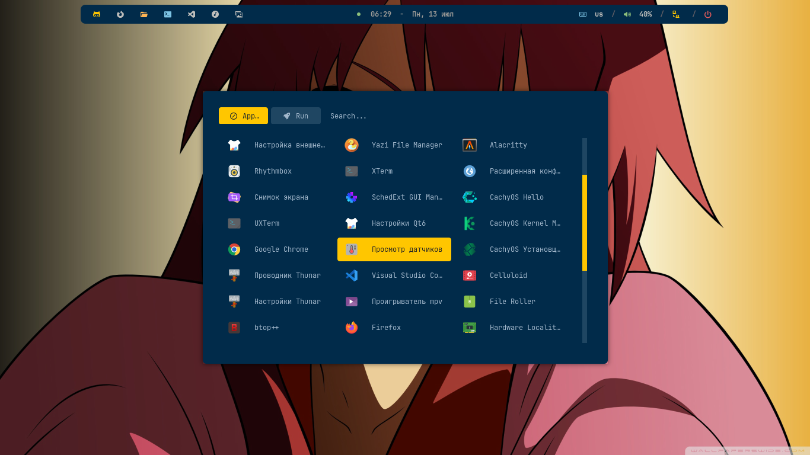
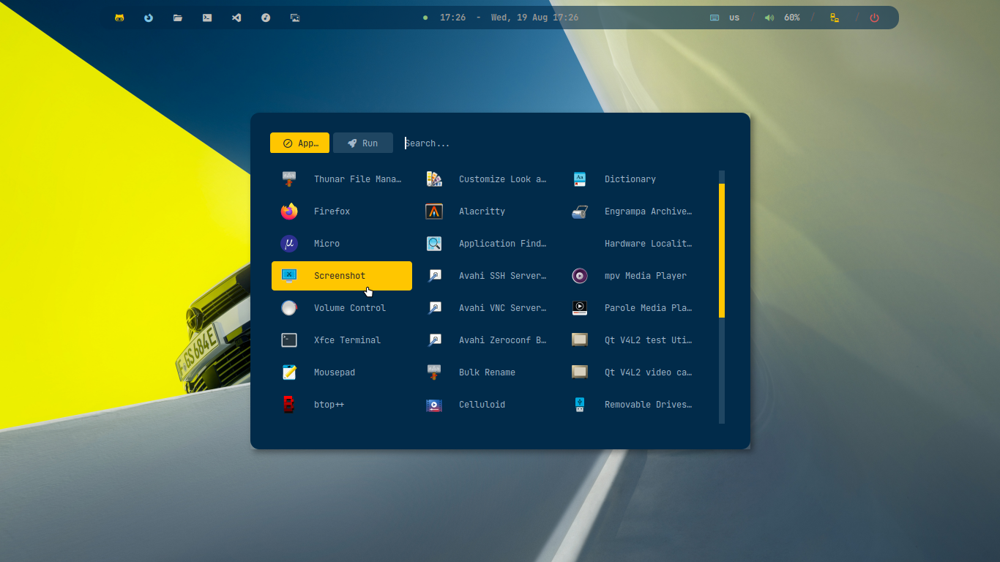
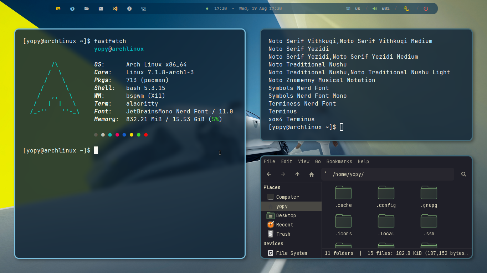

<h1 align="center">

Bspwm Dotfiles   

     

###



</h1> 

## Cobalt2 Theme

 

|  |  |
| :--- | :--- |
| **Window Manager** | `bspwm` |
| **Hotkeys daemon** | `sxhkd` |
| **Status bar** | `polybar` |
| **Terminal** | `alacritty` |
| **Launcher** | `rofi` |
| **Wallpaper** | `feh` |
| **Compositor** | `picom` |
| **Screenshot** | `maim` |
| **Viewer** | `imv` | 

#### Fonts
**Symbols Nerd Font** - icons, interface, development.   
**JetBrains Mono Font** - system font and interface.

> [!IMPORTANT]
> Create folder **Screen** in terminal for saving screenshots   

### Installation

#### 1. Update system
```bash
sudo pacman -Syuu
```

#### 2. Installing BSPWM and basic utilities
```bash
sudo pacman -S bspwm sxhkd rofi picom polybar feh dunst maim slop xclip
```

Give execution rights to configuration scripts:
```bash
chmod +x ~/.config/bspwm/bspwmrc
chmod +x ~/.config/polybar/launch.sh
```

#### 3. Installing the AUR assistant (YAY)
```bash
sudo pacman -S git base-devel
git clone https://aur.archlinux.org/yay-bin.git
cd yay-bin
makepkg -si
```

#### 4. Installing basic applications and dependencies
```bash
yay -S firefox kitty alacritty mousepad \
        thunar thunar-archive-plugin thunar-volman \
        bottom fastfetch yazi mc file-roller \
        p7zip unzip zip ouch \
        wget git curl gvfs udisks2 ntfs-3g \
        xdg-utils glib2 ripgrep zoxide xfce4-screenshooter \
        celluloid rhythmbox imagemagick ffmpeg palette imv \
        lxappearance kvantum qt6ct xorg-xsetroot \
        ttf-jetbrains-mono ttf-nerd-fonts-symbols adwaita-fonts
```

#### 5. Additional software
```bash
yay -S google-chrome visual-studio-code-bin 
```

#### 6. Shell & Fish

```bash
sudo pacman -Sy fish eza fzf fd
```
Changing the standard shell to Fish
```bash
chsh -s $(command -v fish)
```

#### Home Structure

```text
~/
├── wallpapers/
├── icons/
├── themes/
├── .local/share/fonts/
└── .config/
    ├── bspwm/
    ├── sxhkd/
    ├── polybar/
    ├── rofi/
    └── picom/
```

#### Another used Dots, Icons, Themes ...

> [!IMPORTANT]
> [yojeero/config_linux](https://github.com/yojeero/config_linux)  

#### Hide & show polybar

> [!IMPORTANT]
> use keybinding
`
super + p 
`