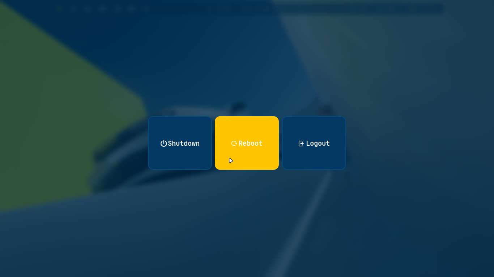

<h1 align="center">

Bspwm 🐧 Dotfiles


###




</h1>

## Cobalt Theme


| **Window Manager**  | `bspwm`  |
| :----------------------------------- | :------------------------- |
| **Hotkeys daemon**                   | `sxhkd`                    |
| **Status bar**                       | `polybar`                  |
| **Terminal**                         | `alacritty`                |
| **Launcher**                         | `rofi`                     |
| **Wallpaper**                        | `feh`                      |
| **Compositor**                       | `picom`                    |
| **Screenshot**                       | `maim`                     |
| **Viewer**                           | `imv`                      |

#### Fonts

**Symbols Nerd Font** - icons, interface, development.  
**JetBrains Mono** - system font and interface.

> [!IMPORTANT]
> Create folder **Screen** in terminal for saving screenshots

### Installation

#### 1. Update system + system

```bash
sudo pacman -Syu

sudo pacman -S \
    xorg-server xorg-xinit \
    xorg-xrandr xorg-xset xorg-xsetroot
```

#### 2. Installing BSPWM and basic utilities

```bash
sudo pacman -S \
    bspwm sxhkd \
    alacritty polybar rofi picom feh \
    maim slop xclip dunst i3lock
```

Give execution rights to configuration scripts:

```bash
chmod +x ~/.config/bspwm/bspwmrc
chmod +x ~/.config/polybar/launch.sh
```

#### 3. Installing basic applications and dependencies

```bash
sudo pacman -S \
    firefox kitty micro mousepad \
    thunar thunar-archive-plugin thunar-volman \
    gvfs udisks2 ntfs-3g tumbler \
    fastfetch mc engrampa btop \
    p7zip unzip zip tar atool \
    wget git curl xdg-utils ripgrep zoxide \
    xfce4-screenshooter celluloid rhythmbox imv \
    imagemagick ffmpeg lxappearance glib2
```

#### Home Structure

```text
~/
├── Pictures/
├── icons/
├── themes/
├── .local/share/fonts/
└── .config/
    ├── bspwm/
    ├── sxhkd/
    ├── polybar/
    ├── rofi/
    └── picom/
```

#### Another used Dots, Icons, Themes ...

> [!IMPORTANT]
> [yojeero/config_linux](https://github.com/yojeero/config_linux)

#### Hide & show polybar

> [!IMPORTANT]
> use keybinding
> `super + p `
